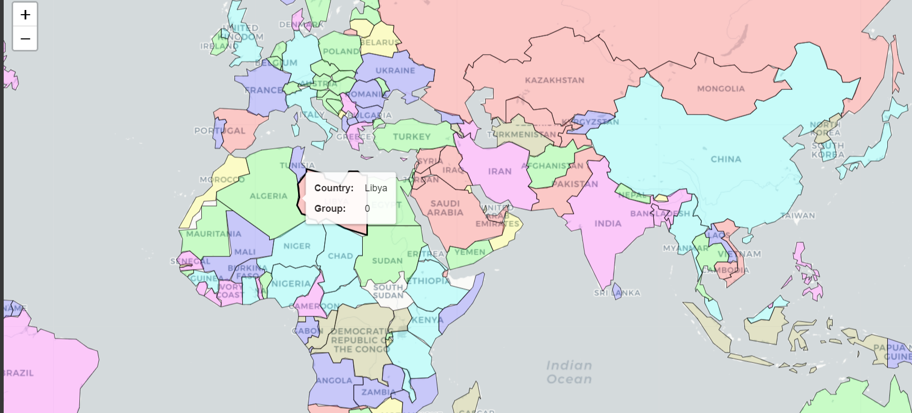

# National Anthem Clustering

Using K-Means algorithm, this has been carried out to classify the national anthems of each country in different clusters. Currently working on BIRCH algorithm to classify the same.  

## Inspiration

I got inspired after watch a youtube video by [India In Pixels](https://www.youtube.com/c/IndiainPixels)

[Video Link](https://youtu.be/a-AqvPtjjts)

[Credits to Author](https://medium.com/@lucasdesa/text-clustering-with-k-means-a039d84a941b)

## Data Collection

For getting started, we need the data. The author has published the dataset on kaggle. Link Below

[Dataset](https://www.kaggle.com/datasets/lucasturtle/national-anthems-of-the-world)

## Color Coding

# Clustering & Word cloud

### Cluster 1 - Glory

### Word Cloud 1 

---------------------------------------

### Cluster 2 - People

### Word Cloud 2

------------------------------------

### Cluster 3 - Land

### Word Cloud 3

------------------------------------

### Cluster 4 - fatherland

### Word Cloud 4

------------------------------------

### Cluster 5 - Liberty

### Word Cloud 5

------------------------------------

### Cluster 6 - Freedom land

### Word Cloud 6

------------------------------------

### Cluster 7 - Island nation

### Word Cloud 7

# Results

